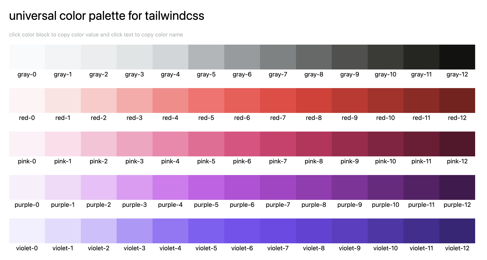

<div align="center">
  
</div>

# tailwindcss-universal-colors

universal color palette for tailwindcss



[preview here](https://cirolee.github.io/tailwindcss-universal-colors/)

## install

```bash
# npm
npm install tailwindcss-universal-colors -D
# yarn
yarn add tailwindcss-universal-colors -D
# pnpm
pnpm add tailwindcss-universal-colors -D

```

## usage

```ts
// tailwind.config.js
import universalColors from 'tailwindcss-universal-colors';

export default {
  theme: {
    extend: {
      colors: {
        ...universalColors,
      },
    },
  },
  // ...
};

// or commonjs for tailwind.config.cjs
const universalColors = require('tailwindcss-universal-colors');
module.exports = {
  theme: {
    extend: {
      colors: {
        ...universalColors,
      },
    },
  },
  // ...
};
```

## inspired

[colar](https://github.com/fchristant/colar)
